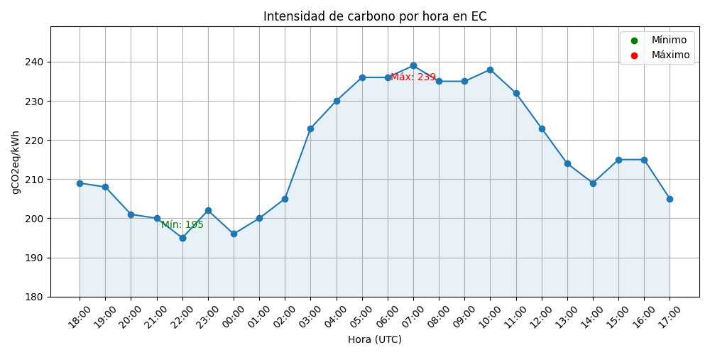
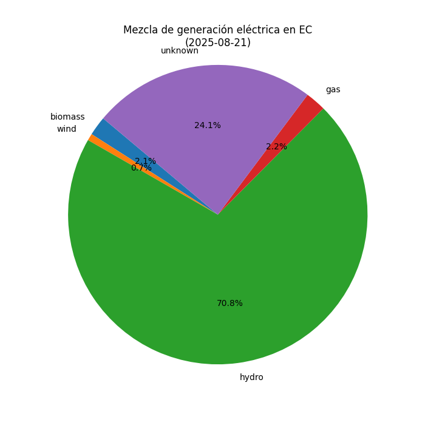

# Análisis de Intensidad de Carbono en la Electricidad 🌍

Este proyecto en Python analiza la **intensidad de carbono** de la red eléctrica en un país específico (por ejemplo, Ecuador 🇪🇨) utilizando datos en tiempo real de la API de [Electricity Maps](https://www.electricitymaps.com/). Genera visualizaciones claras para entender la huella de carbono (gCO2eq/kWh) y la mezcla de fuentes energéticas (hidroeléctrica, fósiles, renovables).

## 🎯 Propósito
La intensidad de carbono mide cuánto CO2 se emite por cada kWh de electricidad generado. Este script:
- Obtiene datos históricos de intensidad de carbono y mezcla energética.
- Crea gráficos (líneas para fluctuaciones horarias, pastel para composición energética).
- Ayuda a concienciar sobre el impacto ambiental de la electricidad, promoviendo el uso de energías renovables.

## 📊 Visualizaciones
- **Gráfico de líneas**: Muestra la intensidad de carbono por hora, destacando mínimos (verde) y máximos (rojo).
- **Gráfico de pastel**: Detalla la mezcla de fuentes (ej. hidroeléctrica, carbón) con colores personalizados.
- **Estadísticas**: Calcula la media de intensidad de carbono para análisis rápidos.

Ejemplo de resultados para Ecuador:



## 🛠 Tecnologías Usadas
- **Python 3.8+**
- **Bibliotecas**: `requests` (peticiones API), `matplotlib` y `seaborn` (visualización), `numpy` (cálculos).
- **API**: Electricity Maps (requiere [API key gratuita](https://www.electricitymaps.com/)).

## 🚀 Instalación y Uso
1. Clona el repositorio:
   ```bash
   git clone git push -u origin https://github.com/Rabedon1/HuellaDeCarbono.git
  
